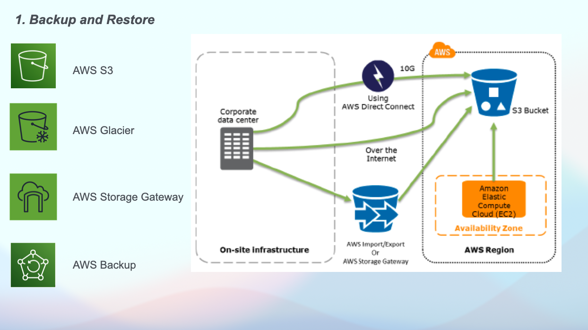
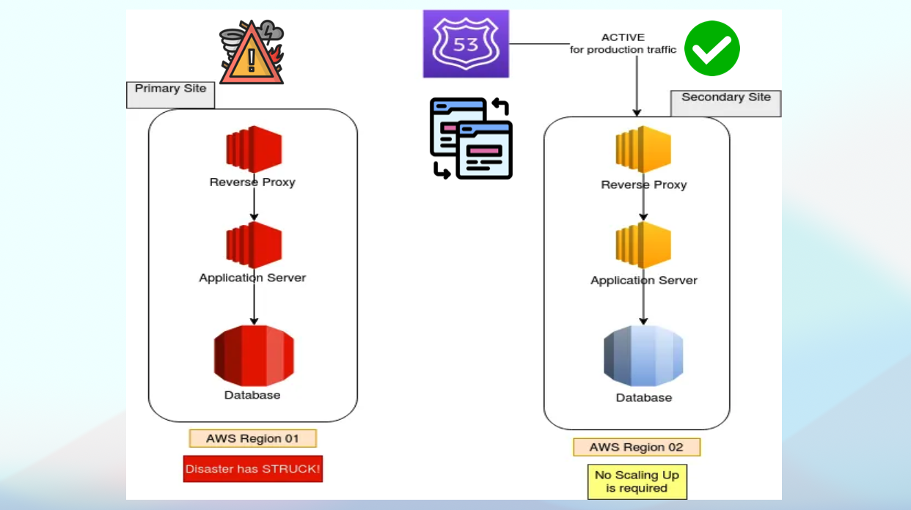

# 🚀 Disaster Recovery on AWS: Scenarios, RPO vs. RTO

## 🌟 Overview
Disaster Recovery (DR) is essential for ensuring business continuity when disaster strikes. In this video, I explain the key DR scenarios and options available on AWS to help you design fault-tolerant and highly available solution architectures.

- **Learn the difference between RPO (Recovery Point Objective) and RTO (Recovery Time Objective)**
- **Get a high-level understanding of various DR scenarios on AWS**
- **Explore the high-level architecture of DR implementation**

## 📝 Comprehensive Guide
For a detailed guide, please refer to the [Youtube video](https://www.youtube.com/watch?v=T8AMCW2GmU4).

## ✅ Slides

Slide 1            | Slide 2         | Slide 3        | Slide 4
:------------------------:|:-----------------------:|:----------------------:|:----------------------:
  |  |  | 

Slide 5            | Slide 6         | Slide 7        | Slide 8
:------------------------:|:-----------------------:|:----------------------:|:----------------------:
  |  |  | 

Slide 9            | Slide 10         | Slide 11        
:------------------------:|:-----------------------:|:----------------------:
  |  | 

Happy learning 📚